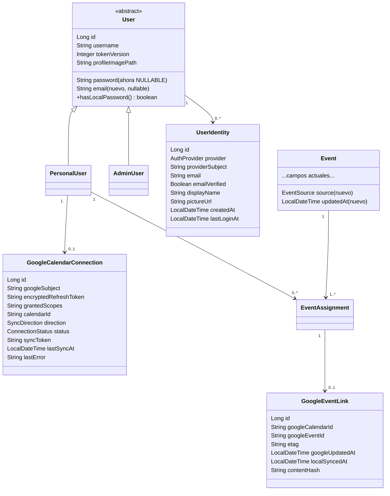
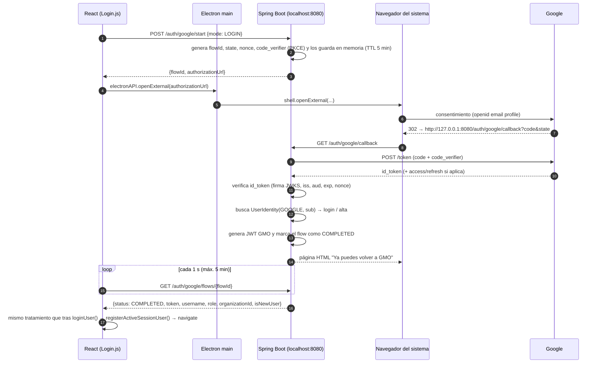

# Integración con Google: inicio de sesión y Google Calendar

Documento de diseño. Describe **cómo** se integraría GMO con una cuenta de Google en dos frentes:

1. **Inicio de sesión / registro con Google** (OpenID Connect).
2. **Sincronización de eventos con Google Calendar** (Calendar API v3).

No hay código implementado todavía. Las referencias a clases, tablas y ficheros apuntan al estado actual de la rama `feat/improvementsgui`.

---

## 1. Punto de partida (estado actual relevante)

| Pieza | Estado actual | Impacto en la integración |
|---|---|---|
| Despliegue | Electron arranca MySQL (Docker, puerto 3310) y el `jar` de Spring Boot en `localhost:8080` **en cada equipo** (`electron/electron.js`). | No hay servidor público: el flujo OAuth tiene que ser de **aplicación instalada** (loopback + PKCE). No se pueden recibir webhooks de Google. |
| `User` (`domains/User.java`) | Herencia `JOINED`: `users` → `personal_users` / `admin_users`. `username` único y obligatorio, `password` `NOT NULL`, `tokenVersion`, `profileImagePath`. **No hay email.** | Una cuenta creada con Google no tiene contraseña → hay que relajar `password` y separar la identidad externa. |
| JWT (`security/JwtUtil.java`) | `subject = username`, claims `tokenVersion` y `desktopClient`. Sin expiración en escritorio. | Se reutiliza tal cual: tras validar Google se emite **el mismo JWT propio** de GMO. Los tokens de Google nunca llegan al frontend. |
| Login (`UserController#loginUser`, `AccServiceImplements#authenticate`) | Usuario + contraseña con BCrypt. | Se añade un segundo camino de autenticación, no se sustituye. |
| Operaciones sensibles | `changePassword`, `changeUsername`, `deleteCurrentUser` exigen `currentPassword`. | Un usuario solo-Google no tiene contraseña: hay que definir re-autenticación alternativa. |
| `Event` + `EventAssignment` | Un evento puede asignarse a varios `PersonalUser` (asignaciones de admin). Fechas en `LocalDateTime` sin zona. Recurrencia **materializada** (una fila por ocurrencia, `recurrenceSeriesId`). No hay `updatedAt`. | El vínculo con Google debe ser **por usuario**, no por evento. Hay que convertir zonas horarias y detectar cambios. |
| Categorías | `FOCUS` activa el modo concentración; `MANDATORY` **apaga el equipo** (`EventService#isEnforceShutdownCategory`). | Un evento importado de Google **nunca** debe convertirse automáticamente en `MANDATORY`/`FOCUS`. |
| `SessionStore` | Un único usuario activo por backend. | El sincronizador periódico trabaja sobre el usuario activo, igual que los demás schedulers. |
| `SecurityConfig` | `anyRequest().permitAll()`; cada controlador valida el JWT a mano. | El callback OAuth debe ser público; el resto de endpoints nuevos valida el JWT como hoy (idealmente comprobando también `tokenVersion`). |
| Dependencias | Spring Web, JPA, Security, Validation, jjwt, Gson. | Hay que añadir las librerías cliente de Google (sección 7). |

---

## 2. Decisiones de diseño

### 2.1 Separar "identidad para iniciar sesión" de "conexión con Calendar"

Son dos cosas distintas y conviene modelarlas por separado:

- **Identidad externa** (`UserIdentity`): "esta cuenta de GMO puede iniciar sesión con la cuenta Google `sub=…`". Solo necesita los scopes `openid email profile`.
- **Conexión de Calendar** (`GoogleCalendarConnection`): "GMO tiene permiso (refresh token) para leer/escribir el calendario de esta cuenta Google". Necesita el scope de Calendar, que es **sensible**.

Motivos:

- Un usuario puede entrar con usuario/contraseña y aun así conectar su Calendar.
- Un usuario puede entrar con Google sin querer dar acceso a su calendario.
- Se aplica **autorización incremental** (Google lo recomienda): primero se piden scopes mínimos y Calendar solo cuando el usuario pulsa "Conectar Google Calendar".
- Desconectar Calendar no debe impedir el login.

### 2.2 El backend local es el cliente OAuth

- Tipo de cliente en Google Cloud: **"Aplicación de escritorio"** (*Desktop app*).
- Redirect URI: `http://127.0.0.1:8080/auth/google/callback` (loopback). Para clientes de escritorio Google acepta loopback sin registrar el puerto.
- Se usa **PKCE (S256)** + `state` + `nonce`.
- El navegador que se abre es el **del sistema** (`shell.openExternal`), no una ventana de Electron: Google bloquea el login OAuth en *webviews* embebidas.
- El *client secret* de una app de escritorio no es realmente secreto (va dentro del instalador); Google lo asume así y por eso PKCE es obligatorio en la práctica. Se lee de `application.properties` / variables de entorno, nunca se commitea.

### 2.3 GMO sigue emitiendo su propio JWT

Google solo sirve para **demostrar la identidad**. Tras verificar el ID token, el backend busca/crea el `User` y genera el JWT de siempre con `tokenService.generateToken(...)`. Así no se toca el resto de controladores, `ProtectedRoute`, `apiClient.js`, ni el WebSocket.

### 2.4 Nada de vincular cuentas por email automáticamente

Hoy los usuarios no tienen email. Aunque se añada, **no** se vincula una cuenta Google a una cuenta local solo porque coincida el email (riesgo de *account takeover*). La vinculación de una cuenta existente es **explícita**, desde Ajustes y con sesión iniciada. El identificador estable es el `sub` de Google, nunca el email.

### 2.5 Sincronización por *pull* periódico

Las *push notifications* de Calendar (`events.watch`) necesitan una URL HTTPS pública: no es viable con un backend en `localhost`. Se sincroniza:

- al iniciar sesión / al conectar,
- periódicamente con `@Scheduled` (ya hay `@EnableScheduling` en `TfgappApplication`),
- bajo demanda con un botón "Sincronizar ahora".

---

## 3. Cambios en el modelo de datos

### 3.1 Diagrama propuesto



### 3.2 `User` (modificación)

```java
@Column(nullable = true)          // antes nullable = false
private String password;

@Column(unique = true)            // opcional, solo informativo
private String email;

@JsonIgnore
@OneToMany(mappedBy = "user", cascade = CascadeType.ALL, orphanRemoval = true)
private List<UserIdentity> identities = new ArrayList<>();

public boolean hasLocalPassword() {
    return password != null && !password.isBlank();
}
```

> **Ojo con `ddl-auto=update`**: Hibernate crea tablas y columnas nuevas, pero **no** relaja una restricción `NOT NULL` existente. Hace falta una migración manual una vez:
>
> ```sql
> ALTER TABLE users MODIFY password VARCHAR(255) NULL;
> ```
>
> Es buen momento para introducir **Flyway** (`spring-boot-starter-flyway` + `db/migration/V1__baseline.sql`, `V2__google_identity.sql`) y dejar de depender de `ddl-auto=update` en producción. Si no, documentar el `ALTER` en el instalador/primer arranque.

Alternativa descartada: guardar en `password` un hash aleatorio inutilizable para las cuentas Google. Evita la migración, pero oculta la realidad ("¿tiene contraseña?") y complica los flujos de Ajustes.

### 3.3 `UserIdentity` (nueva) — tabla `user_identities`

```java
@Entity
@Table(name = "user_identities",
       uniqueConstraints = {
           @UniqueConstraint(columnNames = {"provider", "provider_subject"}),
           @UniqueConstraint(columnNames = {"user_id", "provider"})
       })
public class UserIdentity {
    @Id @GeneratedValue(strategy = GenerationType.IDENTITY) private Long id;

    @ManyToOne(fetch = FetchType.LAZY, optional = false)
    @JoinColumn(name = "user_id")
    private User user;                       // referencia a la tabla base: vale para PERSONAL y ADMIN

    @Enumerated(EnumType.STRING) @Column(nullable = false, length = 16)
    private AuthProvider provider;           // enum nuevo: GOOGLE (extensible a MICROSOFT, GITHUB…)

    @Column(name = "provider_subject", nullable = false, length = 255)
    private String providerSubject;          // claim "sub" del ID token

    private String email;
    private Boolean emailVerified;
    private String displayName;
    private String pictureUrl;
    private LocalDateTime createdAt;
    private LocalDateTime lastLoginAt;
}
```

Repositorio: `UserIdentityRepo.findByProviderAndProviderSubject(AuthProvider, String)`.

### 3.4 `GoogleCalendarConnection` (nueva) — tabla `google_calendar_connections`

Solo para `PersonalUser`, porque los eventos se asignan a `PersonalUser` (`EventAssignment.personalUser`). Los admins no tienen calendario propio en el modelo actual.

| Campo | Tipo | Notas |
|---|---|---|
| `personal_user_id` | FK única | Una conexión por usuario. |
| `google_subject` | varchar | `sub` de la cuenta Google conectada (puede ser distinta de la de login). |
| `encrypted_refresh_token` | text | **Cifrado** AES-GCM (ver 6.3). |
| `access_token` / `access_token_expires_at` | opcional | Se puede mantener solo en memoria; caduca en ~1 h. |
| `granted_scopes` | varchar | Para saber si es solo lectura o lectura/escritura. |
| `calendar_id` | varchar | `primary` por defecto o un calendario elegido/creado ("GMO"). |
| `direction` | enum `SyncDirection` | `IMPORT_ONLY`, `EXPORT_ONLY`, `TWO_WAY`. |
| `status` | enum `ConnectionStatus` | `ACTIVE`, `NEEDS_REAUTH`, `REVOKED`, `ERROR`. |
| `sync_token` | varchar | `nextSyncToken` de Calendar (sincronización incremental, fase 2). |
| `sync_window_past_days` / `sync_window_future_days` | int | Ventana de importación (p. ej. 30 / 365). |
| `last_sync_at`, `last_error` | | Mostrados en Ajustes. |

### 3.5 `Event` (modificación)

```java
@Enumerated(EnumType.STRING)
@Column(nullable = false, length = 16)
private EventSource source = EventSource.LOCAL;   // LOCAL | GOOGLE

private LocalDateTime createdAt;
private LocalDateTime updatedAt;                  // @PrePersist / @PreUpdate

@PrePersist void onCreate() { createdAt = updatedAt = LocalDateTime.now(); }
@PreUpdate  void onUpdate() { updatedAt = LocalDateTime.now(); }
```

`updatedAt` es imprescindible para resolver conflictos ("¿qué lado cambió último?"). Hoy no existe.

### 3.6 `GoogleEventLink` (nueva) — tabla `google_event_links`

El vínculo cuelga de **`EventAssignment`** y no de `Event` porque un mismo evento asignado por un admin a 10 usuarios acaba siendo 10 eventos distintos en 10 calendarios de Google distintos.

```java
@Entity
@Table(name = "google_event_links",
       uniqueConstraints = @UniqueConstraint(columnNames = {"connection_id", "google_calendar_id", "google_event_id"}))
public class GoogleEventLink {
    @Id @GeneratedValue(strategy = GenerationType.IDENTITY) private Long id;

    @OneToOne(fetch = FetchType.LAZY, optional = false)
    @JoinColumn(name = "event_assignment_id", unique = true)
    private EventAssignment assignment;

    @ManyToOne(fetch = FetchType.LAZY, optional = false)
    @JoinColumn(name = "connection_id")
    private GoogleCalendarConnection connection;

    private String googleCalendarId;
    private String googleEventId;      // con singleEvents=true cada instancia tiene su propio id
    private String etag;               // para If-Match en updates (control de concurrencia)
    private LocalDateTime googleUpdatedAt;
    private LocalDateTime localSyncedAt;
    private String contentHash;        // hash de título+fechas+descr+ubicación para detectar cambios reales
}
```

Añadir en `EventAssignment` la relación inversa con `cascade = REMOVE` para que al borrar el evento local se limpie el vínculo (y el sincronizador sepa que debe borrar en Google; ver 5.4, usar *soft delete* o cola de borrados).

### 3.7 Borrado de cuenta

`AccServiceImplements#deleteCurrentUser` debe además:

1. Revocar el refresh token en Google (`POST https://oauth2.googleapis.com/revoke`).
2. Borrar `GoogleEventLink`, `GoogleCalendarConnection` y `UserIdentity` del usuario (cascada).
3. **No** borrar los eventos del calendario de Google del usuario (son suyos); como mucho ofrecerlo como opción.

---

## 4. Inicio de sesión con Google

### 4.1 Flujo



Notas:

- El resultado se entrega por **polling** a `/auth/google/flows/{flowId}` porque es lo más simple y no depende de la conexión STOMP (que hoy se abre después del login). El `flowId` es aleatorio (UUID/128 bits), de **un solo uso** y caduca a los 5 minutos.
- Alternativa: publicar el resultado por STOMP o registrar un protocolo `gmo://` en Electron (`app.setAsDefaultProtocolClient`) para devolver el foco a la app. Se puede añadir después; el polling basta para el TFG.
- `electron.js` debería además traer la ventana principal al frente (`win.focus()`) cuando el flujo se complete.

### 4.2 Reglas de resolución de cuenta (`GoogleAuthService#resolveLogin`)

1. Existe `UserIdentity(GOOGLE, sub)` → login de ese `User`. Actualizar `lastLoginAt`, `email`, `pictureUrl`.
2. No existe:
   - Modo `LOGIN` → **alta** de un `PersonalUser` sin organización, igual que el registro público (`AccServiceImplements#register`):
     - `username` generado a partir de la parte local del email (`maria.lopez`) normalizado; si existe, sufijo numérico (`maria.lopez2`). Se devuelve `isNewUser=true` para que la UI pueda proponer cambiarlo.
     - `password = null`.
     - Foto de perfil: opcionalmente descargar `picture` y guardarla con `StorageServiceImpl` (no enlazar la URL de Google directamente: `profileImagePath` hoy es una ruta local servida en `/uploads/**`).
   - Modo `LINK` (desde Ajustes, con JWT válido) → crear `UserIdentity` para el usuario autenticado. Si ese `sub` ya está vinculado a **otro** usuario → error 409.
3. Exigir `email_verified = true`.
4. Los `AdminUser` solo pueden **vincular** Google para iniciar sesión, no se crean admins vía Google (el alta de admins sigue el flujo actual).

### 4.3 Impacto en flujos existentes

| Flujo | Cambio |
|---|---|
| `authenticate` (login clásico) | Si `!user.hasLocalPassword()` → 401 con mensaje "Esta cuenta usa Google para iniciar sesión" (texto i18n en `TextConstants`). |
| `changePassword` | Si el usuario no tiene contraseña: permitir **establecer** una sin `currentPassword` (endpoint `POST /users/set/password`, solo válido cuando `password == null`). |
| `changeUsername` / `deleteCurrentUser` | Si no tiene contraseña: aceptar re-autenticación reciente con Google (flow `REAUTH` que devuelve un *reauth ticket* de un uso válido 5 min) o, como mínimo, confirmación escribiendo el username. |
| Desvincular Google | Prohibido si es el **único** método de acceso (sin contraseña y sin otras identidades). |
| `UserProfileResponse` | Añadir `hasPassword`, `linkedProviders` (`["GOOGLE"]`), `googleEmail`, `googleCalendar` (`{connected, status, calendarId, lastSyncAt}`). |
| JWT | Sin cambios obligatorios. Opcional: claim `amr` (`pwd`/`google`). Recomendable a medio plazo usar `subject = id` en vez de `username` (hoy cambiar el username obliga a reemitir token). |

---

## 5. Sincronización con Google Calendar

### 5.1 Scopes

| Opción | Scope | Uso |
|---|---|---|
| Solo importar | `https://www.googleapis.com/auth/calendar.events.readonly` (+ `calendar.calendarlist.readonly` para listar calendarios) | Ver en GMO los eventos de Google. |
| Bidireccional | `https://www.googleapis.com/auth/calendar.events` | Crear/editar/borrar eventos. |
| Menos intrusivo | `https://www.googleapis.com/auth/calendar.app.created` | GMO crea su **propio** calendario "GMO" y solo gestiona ese. Muy buena opción para exportar sin tocar el calendario principal del usuario. |

Todos son **sensibles**: con la app en modo *Testing* en Google Cloud solo pueden usarla los *test users* dados de alta (máx. 100) y **los refresh tokens caducan a los 7 días**. Para la demo del TFG es suficiente, pero hay que contemplar el estado `NEEDS_REAUTH` (ver 6.4). Publicar la app requiere verificación de Google.

Recomendación para el TFG: **importar del calendario principal** (`calendar.events.readonly` o `calendar.events`) **y exportar a un calendario "GMO"** dedicado. Se pide `access_type=offline` y `include_granted_scopes=true`.

### 5.2 Mapeo de campos

| GMO (`Event`) | Google (`Event` resource) | Detalle |
|---|---|---|
| `title` | `summary` | |
| `description` | `description` | Google admite HTML; al importar, quitar etiquetas. |
| `location` | `location` | |
| `startTime` / `endTime` (`LocalDateTime`) | `start.dateTime` / `end.dateTime` + `timeZone` | Convertir con la zona del usuario (`ZoneId.systemDefault()` en escritorio; guardar zona en la conexión para no depender del SO). |
| `isAllDay = true` | `start.date` / `end.date` | En Google `end.date` es **exclusivo** (evento de un día: `end = start + 1`). En GMO hoy se guarda 00:00–23:59 del mismo día: convertir en ambos sentidos. |
| `reminderMinutesBeforeList` | `reminders.useDefault=false`, `reminders.overrides[{method: popup, minutes}]` | Google admite máx. 5 overrides; recortar. Si `useDefault=true`, al importar se usan los predeterminados del calendario o se deja vacío. |
| `category` | `extendedProperties.private.gmoCategory` (+ `colorId` opcional) | Las *private extended properties* solo las ve esa copia del calendario. Ver 5.6 sobre seguridad. |
| `id` | `extendedProperties.private.gmoEventId` | Permite reconocer eventos creados por GMO aunque se pierda el `GoogleEventLink`. |
| `recurrenceSeriesId` | `extendedProperties.private.gmoSeriesId` | |
| `source = GOOGLE` | — | Marcado de eventos importados (icono de Google en la UI). |
| `assignedByAdmin` | `extendedProperties.private.gmoAssignedBy` | Ver 5.5. |

### 5.3 Recurrencia

GMO **materializa** cada ocurrencia como un `Event` independiente; Google usa `RRULE`.

- **Importar**: `events.list` con `singleEvents=true` expande las series en instancias individuales, cada una con su propio `id` (`<idBase>_<fecha>`) y `recurringEventId`. Encaja directamente con el modelo de GMO: una instancia = un `Event` local con `source=GOOGLE` y `recurrenceSeriesId = recurringEventId`.
- **Exportar** (fase 1): exportar cada ocurrencia de GMO como evento suelto. Coherente con el modelo actual y sin reglas que traducir.
- Mejora futura: exportar las series de GMO como un único evento con `RRULE` (`DAILY` → `RRULE:FREQ=DAILY;UNTIL=…`, `WEEKDAYS` → `FREQ=WEEKLY;BYDAY=MO,TU,WE,TH,FR`, `CUSTOM` → `BYDAY` de `recurrenceWeekdays`). Requiere vincular la serie y no cada ocurrencia.

### 5.4 Algoritmo de sincronización (`GoogleCalendarSyncService#sync(connection)`)

**Fase 1 — ventana deslizante (simple y robusta):**

1. Obtener access token válido (refrescar con el refresh token si ha caducado).
2. **Pull**: `events.list(calendarId, timeMin=now-30d, timeMax=now+365d, singleEvents=true, showDeleted=true, maxResults=250)` paginando con `pageToken`.
3. Para cada evento remoto:
   - Si `extendedProperties.private.gmoEventId` existe y es nuestro → es un evento exportado; solo actualizar `etag`/`googleUpdatedAt` del link.
   - Si `status = cancelled` → borrar el `Event` local vinculado (si `source=GOOGLE`).
   - Si hay `GoogleEventLink` → comparar `updated` remoto con `localSyncedAt` y `Event.updatedAt` (5.5) y aplicar cambios.
   - Si no hay link → crear `Event` (`source=GOOGLE`, `category=PERSONAL`) con una `EventAssignment` al usuario y su `GoogleEventLink`. **Reutilizar `EventService.save`** para que `ReminderScheduler` programe los recordatorios.
4. Los `GoogleEventLink` dentro de la ventana que no aparecen en la respuesta → el evento se borró en Google.
5. **Push** (si `direction` lo permite): asignaciones del usuario con `Event.updatedAt > localSyncedAt` o sin link → `events.insert` / `events.patch` (con `If-Match: etag`). Eventos locales borrados → `events.delete` (necesita guardar los borrados pendientes: tabla `google_pending_deletions` o *soft delete* del link antes de borrar el evento).
6. Guardar `lastSyncAt`, limpiar `lastError`.

**Fase 2 — incremental con `syncToken`:** guardar `nextSyncToken` y en siguientes llamadas pasar solo `syncToken` (no se puede combinar con `timeMin`/`timeMax`). Si Google responde **410 Gone**, borrar el token y repetir una sincronización completa. Verificar en la documentación oficial qué parámetros se admiten junto a `syncToken` antes de implementarlo.

**Disparadores:**

```java
@Scheduled(fixedDelayString = "${google.calendar.sync-interval-ms:300000}")  // 5 min
public void syncActiveUser() {
    Long userId = sessionStore.getLoggedUserId();   // mismo patrón que EventService#isEnforceShutdownCategory
    if (userId == null) return;
    connectionRepo.findActiveByPersonalUserId(userId).ifPresent(syncService::syncSafely);
}
```

más `POST /integrations/google-calendar/sync` y una sincronización al conectar. Proteger con un lock por conexión para evitar dos sincronizaciones simultáneas. Tras sincronizar, notificar al frontend por STOMP (p. ej. `/topic/calendar-sync`) para que `useCalendarEvents` recargue el rango visible.

**Hooks en `EventService`:** tras `createEvents`, `updateEventById`, `deleteEventById` y la edición de admin en `CalendarController#updateEvent`, publicar un `ApplicationEvent` (`LocalEventChanged`) — igual que ya se hace con `BlockingEvent` — para que el sincronizador empuje el cambio pronto sin acoplar `EventService` a Google.

### 5.5 Conflictos

| Caso | Política |
|---|---|
| Cambió solo un lado | Ese lado gana. |
| Cambiaron ambos desde el último sync | *Last-writer-wins* comparando `Event.updatedAt` y `updated` de Google. Registrar el conflicto en log. |
| Evento **asignado por admin** (`audAdmin != null`) | **GMO es la fuente de verdad**: si el usuario lo edita o borra en Google, se vuelve a escribir en la siguiente sincronización. Coherente con que hoy el usuario no puede editar/borrar eventos asignados (`CalendarController`). |
| Evento editado en GMO con `source=GOOGLE` y conexión `IMPORT_ONLY` | No se permite editar en la UI (solo lectura) o se avisa de que se sobrescribirá. |

### 5.6 Seguridad funcional: `FOCUS` y `MANDATORY`

`MANDATORY` provoca `WindowsUtils.shutdownSystem()` y `FOCUS` activa bloqueos. Cualquiera que pueda escribir en el calendario de Google del usuario (calendarios compartidos, invitaciones que se añaden solas) podría provocar un apagado.

Reglas:

- Los eventos importados se crean **siempre** como `PERSONAL` (o la categoría mapeada desde `colorId` entre `WORK/PERSONAL/STUDY/HEALTH`).
- Solo se respeta `gmoCategory = MANDATORY|FOCUS` si el evento lleva `gmoEventId` de un evento **creado en GMO** y existe su `GoogleEventLink`.
- Si en Google se cambia la categoría a `MANDATORY` de un evento que no lo era, se ignora.
- Ignorar invitaciones no aceptadas (`attendees[self].responseStatus = needsAction/declined`) o importarlas sin recordatorios.

---

## 6. Seguridad

1. **PKCE + state + nonce** en todos los flujos. `state` y `code_verifier` en memoria con TTL; el `state` identifica el `flowId` y el modo (`LOGIN`, `LINK`, `CALENDAR`, `REAUTH`) y, en `LINK`/`CALENDAR`, el `userId` que lo inició.
2. **Verificación del ID token**: firma con las claves JWKS de Google, `iss ∈ {accounts.google.com, https://accounts.google.com}`, `aud = clientId`, `exp`, `nonce`. Con `GoogleIdTokenVerifier` de la librería oficial.
3. **Refresh tokens cifrados en BD** con AES-256-GCM (`javax.crypto`). Clave:
   - variable de entorno `GMO_TOKEN_ENCRYPTION_KEY`, o
   - generada en el primer arranque y guardada en `%APPDATA%/GMO/secret.key` (o protegida con DPAPI de Windows vía JNA, que ya es dependencia).
   Nunca se devuelven al frontend ni se loguean (ojo con `spring.jpa.show-sql=true`, que no imprime valores pero sí conviene revisar logs de excepciones).
4. **Callback público pero inofensivo**: `/auth/google/callback` solo acepta `state` conocidos y no caducados; responde HTML estático sin datos.
5. **Electron**: exponer en `preload.js` un `openExternal(url)` que en `electron.js` solo acepte URLs que empiecen por `https://accounts.google.com/`.
6. **Revocación** al desconectar y al borrar la cuenta.
7. **Deuda existente que conviene cerrar a la vez**: la mayoría de controladores (`CalendarController#getCurrentUser`, `SessionController`) solo verifican la firma del JWT y no `tokenVersion`. Al añadir login con Google es buen momento para centralizar la validación (`OncePerRequestFilter` que use `validateToken(token, username, tokenVersion)` y deje el usuario en el `SecurityContext`), y reemplazar el `permitAll()` global por reglas por ruta.
8. CORS: el callback lo abre el navegador como navegación normal, no requiere CORS. No añadir orígenes nuevos.

---

## 7. Backend: piezas a implementar

### 7.1 Dependencias (`backend/pom.xml`)

```xml
<!-- Cliente OAuth / verificación de ID token -->
<dependency>
    <groupId>com.google.api-client</groupId>
    <artifactId>google-api-client</artifactId>
    <version><!-- última estable --></version>
</dependency>
<!-- Credenciales (UserCredentials con refresh token) -->
<dependency>
    <groupId>com.google.auth</groupId>
    <artifactId>google-auth-library-oauth2-http</artifactId>
    <version><!-- última estable --></version>
</dependency>
<!-- Cliente tipado de Calendar API v3 -->
<dependency>
    <groupId>com.google.apis</groupId>
    <artifactId>google-api-services-calendar</artifactId>
    <version><!-- v3-rev… última estable --></version>
</dependency>
```

Se descarta `spring-boot-starter-oauth2-client`: está pensado para login web con sesión HTTP y redirecciones del propio Spring, y aquí la autenticación es un JWT propio con `permitAll`; adaptarlo costaría más que usar la librería de Google directamente.

### 7.2 Configuración (`application.properties`)

```properties
google.oauth.client-id=${GOOGLE_CLIENT_ID:}
google.oauth.client-secret=${GOOGLE_CLIENT_SECRET:}
google.oauth.redirect-uri=http://127.0.0.1:8080/auth/google/callback
google.calendar.sync-interval-ms=300000
google.calendar.window-past-days=30
google.calendar.window-future-days=365
gmo.security.token-encryption-key=${GMO_TOKEN_ENCRYPTION_KEY:}
```

Si `client-id` está vacío, la funcionalidad se desactiva y la UI oculta los botones (`GET /auth/google/enabled`).

### 7.3 Clases nuevas (siguiendo la estructura de paquetes actual)

```
domains/
  UserIdentity.java
  GoogleCalendarConnection.java
  GoogleEventLink.java
enumerates/
  AuthProvider.java            GOOGLE
  EventSource.java             LOCAL, GOOGLE
  SyncDirection.java           IMPORT_ONLY, EXPORT_ONLY, TWO_WAY
  ConnectionStatus.java        ACTIVE, NEEDS_REAUTH, REVOKED, ERROR
  GoogleFlowMode.java          LOGIN, LINK, CALENDAR, REAUTH
repos/
  UserIdentityRepo.java
  GoogleCalendarConnectionRepo.java
  GoogleEventLinkRepo.java
DTOs/google/
  GoogleAuthStartRequest.java      {mode}
  GoogleAuthStartResponse.java     {flowId, authorizationUrl}
  GoogleFlowStatusResponse.java    {status, token?, username?, role?, organizationId?, isNewUser?, error?}
  GoogleCalendarStatusResponse.java
  GoogleCalendarSettingsRequest.java  {calendarId, direction, enabled}
  GoogleCalendarSummaryDTO.java    {id, summary, primary, accessRole}
components/
  GoogleOAuthFlowStore.java        flows pendientes en memoria (ConcurrentHashMap + expiración)
security/
  TokenCipher.java                 AES-GCM para refresh tokens
service/interfaces/
  IGoogleAuthService.java
  IGoogleCalendarService.java
  GoogleCalendarClient.java        interfaz fina sobre la API (permite mockear en tests)
service/implementations/
  GoogleAuthServiceImpl.java       start, callback, resolveLogin, link, unlink
  GoogleCalendarServiceImpl.java   connect, disconnect, status, settings, listCalendars
  GoogleCalendarSyncService.java   algoritmo de 5.4
  GoogleApiCalendarClient.java     implementación real con com.google.api.services.calendar.Calendar
mappers/
  GoogleEventMapper.java           Event <-> com.google.api.services.calendar.model.Event (5.2)
schedulers/
  GoogleCalendarSyncScheduler.java
events/
  LocalEventChanged.java + listener
controller/
  GoogleAuthController.java        /auth/google/**
  GoogleCalendarController.java    /integrations/google-calendar/**
```

### 7.4 API REST

| Método | Ruta | Auth | Descripción |
|---|---|---|---|
| GET | `/auth/google/enabled` | no | `{enabled: bool}` según configuración. |
| POST | `/auth/google/start` | JWT si `mode ≠ LOGIN` | Crea el flow y devuelve `authorizationUrl`. |
| GET | `/auth/google/callback` | no (lo abre el navegador) | Intercambia el `code`, completa el flow, responde HTML. |
| GET | `/auth/google/flows/{flowId}` | no (flowId secreto, un uso) | Polling del resultado. |
| DELETE | `/users/me/identities/google` | JWT | Desvincula Google (si no es el único acceso). |
| POST | `/users/set/password` | JWT | Establece contraseña a cuentas solo-Google. |
| GET | `/integrations/google-calendar` | JWT | Estado de la conexión. |
| GET | `/integrations/google-calendar/calendars` | JWT | `calendarList.list` para elegir calendario. |
| PUT | `/integrations/google-calendar/settings` | JWT | Calendario, dirección, activado. |
| POST | `/integrations/google-calendar/sync` | JWT | Sincronizar ahora. |
| DELETE | `/integrations/google-calendar` | JWT | Desconectar + revocar. Parámetro `removeImported=true/false` para borrar o conservar los eventos importados. |

`GET /events/range` no cambia de contrato; solo añade `source` en la respuesta.

Textos nuevos en `xi18n/TextConstants.java` (es/en), p. ej. `auth.google.accountUsesGoogle`, `auth.google.alreadyLinked`, `auth.google.cannotUnlinkOnlyMethod`, `calendar.google.needsReauth`.

---

## 8. Frontend: piezas a implementar

### 8.1 Electron

`electron/preload.js`:

```js
openExternal: (url) => ipcRenderer.invoke("shell:open-external", url),
```

`electron/electron.js`:

```js
ipcMain.handle("shell:open-external", (_event, url) => {
  if (typeof url !== "string" || !url.startsWith("https://accounts.google.com/")) {
    return false;
  }
  shell.openExternal(url);
  return true;
});
```

En navegador (modo `web`), usar `window.open(url, "_blank")`.

### 8.2 API (`src/api/`)

- `googleAuthApi.js`: `isGoogleEnabled()`, `startGoogleFlow(mode)`, `pollGoogleFlow(flowId)`, `unlinkGoogle()`.
- `googleCalendarApi.js`: `getCalendarStatus()`, `listGoogleCalendars()`, `updateCalendarSettings()`, `syncNow()`, `disconnectCalendar()`.
- Helper `runGoogleFlow(mode)` que encadena *start → openExternal → polling* con cancelación y timeout.

### 8.3 Pantallas

- **`Login.js` y `Register.js`**: botón "Continuar con Google" (siguiendo las *branding guidelines* de Google). Al completar, extraer la lógica que hoy hay tras `loginUser()` (guardar token, perfil, `registerActiveSessionUser`, navegación por rol) a una función común `completeLogin(data)` para no duplicarla. Si `isNewUser`, mostrar una vez el aviso "Tu usuario es X, puedes cambiarlo en Ajustes".
- **`Settings.js`**: nueva sección `settingsCard` **"Cuentas conectadas"**:
  - Google: vincular / desvincular, email vinculado.
  - Google Calendar: conectar, selector de calendario (`CustomSelectDropdown`), dirección de sincronización, última sincronización, "Sincronizar ahora", desconectar (con `ConfirmDialog` y opción de conservar eventos importados), aviso si `NEEDS_REAUTH`.
  - Las secciones de Cuenta/Seguridad se adaptan a `hasPassword` (mostrar "Establecer contraseña" en lugar de "Cambiar contraseña"; borrar cuenta con re-autenticación de Google).
- **Calendario** (`MonthView`, `WeekView`, `DailyCalendarView`, `EventModal`): icono de Google en eventos con `source === "GOOGLE"`; en `EventModal`, campos de solo lectura si la conexión es `IMPORT_ONLY`; ocultar `MANDATORY`/`FOCUS` como opción al editar eventos importados.
- **`useCalendarEvents`**: suscribirse a `/topic/calendar-sync` para recargar.
- Textos en `src/constants/textConstants.js` (es/en) y pasar `npm run i18n:audit`.

---

## 9. Configuración en Google Cloud Console

1. Crear proyecto "GMO".
2. *APIs y servicios → Biblioteca*: habilitar **Google Calendar API**.
3. *Pantalla de consentimiento OAuth*: tipo **Externo**, estado **Testing**, añadir los scopes de 5.1 y los *test users* (tu cuenta y la del tribunal si van a probarlo).
4. *Credenciales → Crear ID de cliente OAuth → Aplicación de escritorio*.
5. Copiar `client_id` y `client_secret` a variables de entorno (`GOOGLE_CLIENT_ID`, `GOOGLE_CLIENT_SECRET`) o a un `application-local.properties` ignorado por git.
6. Para el instalador: inyectar los valores en el `jar` empaquetado o pasarlos como variables de entorno al `spawn` de Java en `electron.js`.

---

## 10. Plan de implementación por fases

| Fase | Contenido | Entregable verificable |
|---|---|---|
| **0. Preparación** | Flyway (o script `ALTER`), `updatedAt`/`source` en `Event`, `password` nullable, `hasLocalPassword()`. Filtro JWT centralizado (opcional pero recomendado). | La app funciona igual que antes; tests de `EventServiceTest` en verde. |
| **1. Login con Google** | `UserIdentity`, `GoogleOAuthFlowStore`, `GoogleAuthController`, verificación de ID token, alta/login, `openExternal` en Electron, botón en Login/Register. | Crear cuenta y entrar con Google; el JWT resultante funciona en todas las pantallas. |
| **2. Gestión de cuenta** | Vincular/desvincular en Ajustes, establecer contraseña, re-autenticación para borrar/cambiar username, `UserProfileResponse` ampliado. | Un usuario local vincula Google y puede entrar por ambos caminos. |
| **3. Calendar: importar** | `GoogleCalendarConnection`, cifrado de tokens, flow `CALENDAR` (autorización incremental), `GoogleEventMapper`, sync por ventana solo lectura, scheduler, UI de estado. | Los eventos de Google aparecen en el calendario de GMO con su icono y recordatorios. |
| **4. Calendar: exportar / bidireccional** | `GoogleEventLink` en push, `extendedProperties`, borrados pendientes, conflictos, eventos de admin. | Crear/editar/borrar en GMO se refleja en Google y viceversa. |
| **5. Mejoras** | `syncToken` incremental, exportar series como `RRULE`, protocolo `gmo://`, calendario "GMO" dedicado con `calendar.app.created`. | — |

---

## 11. Pruebas

- **Unitarias** (JUnit + Mockito, como `EventServiceTest`):
  - `GoogleEventMapper`: zonas horarias, todo el día (fin exclusivo), recordatorios > 5, HTML en descripción.
  - Reglas de 5.6: un evento remoto con `gmoCategory=MANDATORY` sin link nunca se importa como `MANDATORY`.
  - `GoogleAuthServiceImpl#resolveLogin`: usuario existente, alta con username colisionado, `sub` ya vinculado a otro usuario, `email_verified=false`.
  - Desvincular el único método de acceso → error.
  - `TokenCipher`: cifrar/descifrar, clave errónea.
- **Sincronización** con `GoogleCalendarClient` mockeado: alta, modificación remota, borrado remoto (`cancelled`), conflicto, 401/`invalid_grant` → `NEEDS_REAUTH`, 410 con `syncToken`.
- **Manual / E2E**: flujo completo en la app empaquetada con una cuenta de test; revocar el acceso desde <https://myaccount.google.com/permissions> y comprobar que la UI pide reconectar.

---

## 12. Riesgos y limitaciones

| Riesgo | Mitigación |
|---|---|
| Refresh tokens caducan a los 7 días en modo *Testing*. | Estado `NEEDS_REAUTH` + aviso en Ajustes/Home; explicarlo en la memoria del TFG. |
| Puerto 8080 ocupado → el redirect loopback falla. | Ya es un requisito de la app; si se hace configurable, construir el `redirect_uri` dinámicamente (los clientes de escritorio aceptan cualquier puerto loopback). |
| Cuotas de Calendar API. | Sync cada 5 min de un único usuario activo está muy por debajo; backoff exponencial ante 403 `rateLimitExceeded`/429. |
| Zonas horarias y cambio de hora. | Convertir siempre con `ZoneId` explícito, tests en fechas de cambio horario. |
| Eventos de admin modificados en Google. | GMO sobrescribe (5.5). |
| Apagados no deseados por eventos externos. | Reglas de 5.6. |
| `SessionStore` monousuario. | Asumido; si se migra a servidor (AWS, según comenta `SessionStore`), el sincronizador recorrería todas las conexiones activas y entonces sí serían posibles las *push notifications*. |
